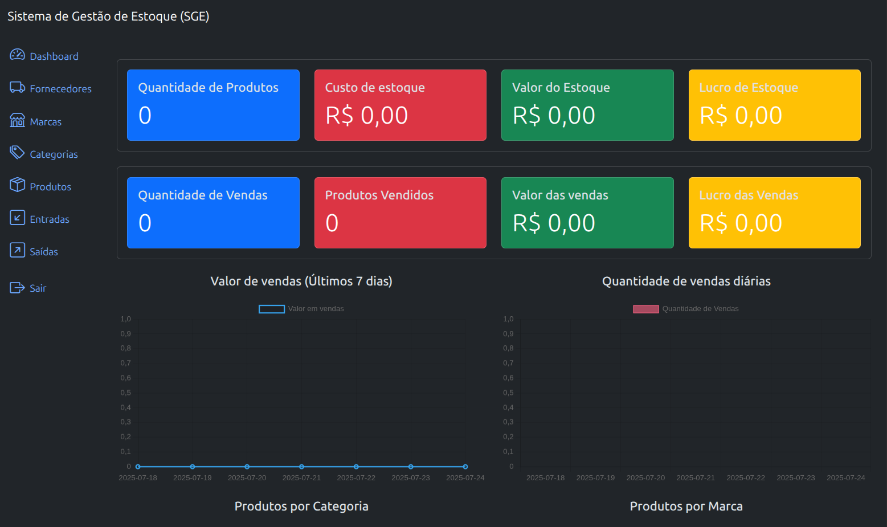

# Sistema de Gestão de Estoque (SGE)



Bem-vindo ao Sistema de Gestão de Estoque (SGE) — uma aplicação desenvolvida com Django e Bootstrap 5, projetada para facilitar o controle de estoque de forma simples e eficiente.

Este repositório contém todas as instruções necessárias para instalar, configurar e executar o sistema em ambiente local.

## Funcionalidades Principais
- ✅ Cadastro de produtos, marcas, fornecedores, categorias, entradas e saídas.
- 🔍 Filtros avançados para pesquisa de produtos.
- 📦 Cálculo automático da quantidade em estoque com base nas movimentações.
- 🔐 Sistema de login e autenticação de usuários.
- 🛡️ Controle de permissões por usuário e/ou grupo, com diferentes níveis de acesso.
- 📊 Dashboard interativo com métricas e gráficos de entradas, saídas, vendas e valor total em estoque.
- 🌐 API RESTful disponível em: /api/v1/<rota>


## Requisitos

Antes de iniciar, certifique-se de ter os seguintes requisitos instalados:

* [Python 3.7+](https://www.python.org/)
* [pip](https://pip.pypa.io/)
* Docker e Docker Compose (opcional)

Todas as dependências do projeto estão listadas no arquivo `requirements.txt`.

## Instalação

1. **Clone o repositório:**

```bash
git clone https://github.com/seu-usuario/sge.git && cd sge
```

2. **Crie e ative um ambiente virtual:**

```bash
python -m venv venv
source venv/bin/activate  # Linux/macOS
venv\Scripts\activate     # Windows
```

3. **Instale as dependências:**

```bash
pip install -r requirements.txt
```

## Executando o Projeto

1. **Aplique as migrações:**

```bash
python manage.py migrate
```

2. **Inicie o servidor de desenvolvimento:**

```bash
python manage.py runserver
```

3. **Acesse no navegador:**

* Sistema: [http://localhost:8000](http://localhost:8000)
* API: [http://localhost:8000/api/v1](http://localhost:8000/api/v1)


## 🐳 Usando com Docker

Se preferir, você pode subir o ambiente com Docker:

```bash
docker-compose up --build
```

## 📂 Estrutura do Projeto (resumo)

```
sge/
├── authentication/   # APP responsável por gerenciar acesso com JWT na API
├── brands/           # APP para Marcas
├── categories/       # APP para Categorias
├── core/             # Coração do sistema
├── inflows/          # APP para entradas
├── outflows/         # APP para saídas
├── products/         # APP de gerenciamento de Produtos
├── scripts/          # Alguns scripts para ajudar o projeto incuindo rotas da api via postman
├── suppliers/        # APP para fornecedores
└── ...
```